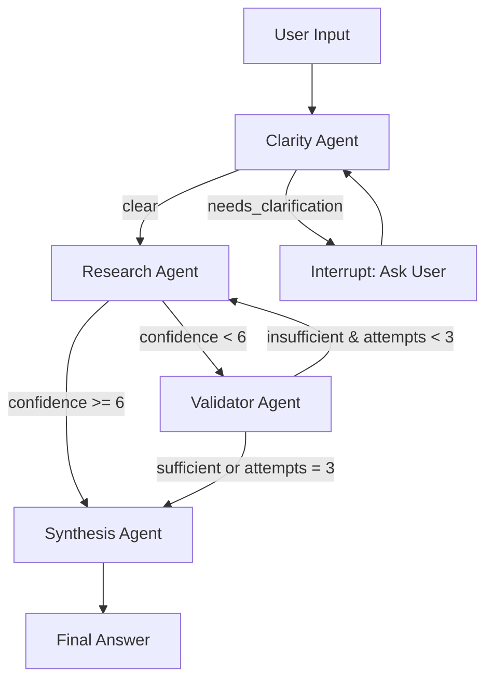

<div align="center">
  
  
  # Velora Business Research Assistant
  
  A production-grade, multi-agent business research assistant powered by **LangGraph**, **Groq (Llama 3.3)**, **Tavily Search**, **FastAPI**, and **React**. Features real-time streaming updates, intelligent company detection, and adaptive research quality validation.
</div>

## 🎯 Overview

Velora is an AI-powered research assistant that intelligently orchestrates multiple specialized agents to deliver comprehensive business insights. It handles ambiguous queries, validates research quality, and provides real-time progress updates through a modern web interface.

## 🏗️ Architecture



### Agent Pipeline

| Agent | Purpose | Key Features |
|-------|---------|--------------|
| **Clarity** | Query understanding & company resolution | • Detects ANY company worldwide (not hardcoded)<br>• Spell-check with confidence scoring<br>• Context-aware company resolution<br>• Filters gibberish/invalid names |
| **Research** | Web search & information gathering | • Tavily API integration<br>• Confidence scoring (0-10)<br>• Source deduplication<br>• Structured findings extraction |
| **Validator** | Research quality assessment | • Evaluates completeness & relevance<br>• Provides refinement suggestions<br>• Triggers retry loop (max 3 attempts) |
| **Synthesis** | Final answer generation | • Markdown-formatted reports<br>• Source citations<br>• Confidence badges<br>• Context-aware responses |

## 🚀 Quick Start

### Prerequisites

- Python 3.10+
- Node.js 18+ (for frontend)
- API Keys:
  - **Groq API**: [console.groq.com](https://console.groq.com) (Free tier available)
  - **Tavily API**: [tavily.com](https://tavily.com) (Free: 1000 searches/month)

### Installation

#### 1. Clone & Setup Backend

```bash
cd ai-agents
pip install -r requirements.txt
```

#### 2. Configure Environment

Create `.env` in the root directory:

```env
GROQ_API_KEY=gsk-your-groq-api-key-here
TAVILY_API_KEY=tvly-your-tavily-api-key-here
LLM_PROVIDER=groq
LLM_MODEL=llama-3.3-70b-versatile
MAX_SEARCH_RESULTS=5
```

#### 3. Setup Frontend

```bash
cd frontend
npm install
```

Create `frontend/.env`:

```env
VITE_API_URL=http://localhost:8000
```

### Running the Application

#### Option 1: Full Stack (Recommended)

**Terminal 1 - Backend:**
```bash
python app/api.py
```
API runs on `http://localhost:8000`

**Terminal 2 - Frontend:**
```bash
cd frontend
npm run dev
```
Frontend runs on `http://localhost:5173`

#### Option 2: CLI Mode

```bash
python app/main_cli.py
```

## 📁 Project Structure

```
ai-agents/
├── app/
│   ├── agents/
│   │   ├── clarity.py          # Query understanding & company detection
│   │   ├── research.py         # Tavily search orchestration
│   │   ├── validator.py        # Research quality validation
│   │   └── synthesis.py        # Final report generation
│   ├── prompts/
│   │   ├── clarity.md          # Clarity agent system prompt
│   │   ├── research.md         # Research agent system prompt
│   │   ├── validator.md        # Validator agent system prompt
│   │   └── synthesis.md        # Synthesis agent system prompt
│   ├── tools/
│   │   └── tavily_search.py    # Tavily API wrapper
│   ├── utils/
│   │   ├── formatting.py       # Citation formatting & deduplication
│   │   ├── history.py          # Conversation context management
│   │   ├── logger.py           # Structured logging
│   │   ├── retry.py            # Error handling utilities
│   │   └── spellcheck.py       # Company name spell-checking
│   ├── api.py                  # FastAPI REST API with SSE streaming
│   ├── config.py               # Environment config & LLM factory
│   ├── graph.py                # LangGraph orchestration
│   ├── state.py                # State schema (TypedDict + Pydantic)
│   └── main_cli.py             # CLI interface
├── frontend/
│   ├── src/
│   │   ├── components/
│   │   │   ├── AgentProgress.jsx    # Real-time agent status
│   │   │   ├── ChatMessage.jsx      # Message rendering
│   │   │   └── Sidebar.jsx          # Session management
│   │   ├── App.jsx             # Main application
│   │   ├── api.js              # API client with SSE
│   │   └── types.js            # TypeScript-style type definitions
│   ├── package.json
│   └── vite.config.js
├── requirements.txt
└── README.md
```

## ✨ Key Features

### 🤖 Multi-Agent Orchestration
- **LangGraph-powered workflow** with conditional routing
- **State management** with TypedDict + Pydantic validation
- **Structured JSON outputs** from each agent for reliability

### 🔍 Intelligent Research
- **Tavily Search integration** for real-time web data
- **Confidence scoring** (0-10) for research quality
- **Automatic retry loop** (up to 3 attempts) for low-confidence results
- **Source deduplication** and citation formatting

### 💬 Conversational AI
- **Multi-turn conversation memory** with context awareness
- **Company name resolution** from conversation history
- **Follow-up question handling** without re-specifying context
- **Spell-check** with confidence-based auto-correction

### 🎨 Modern Web Interface
- **React + Vite** frontend with Tailwind CSS
- **Server-Sent Events (SSE)** for real-time agent progress
- **Markdown rendering** with syntax highlighting
- **Session management** for multiple conversations
- **Responsive design** with mobile support

### 🛡️ Production-Ready
- **Error handling** with graceful fallbacks
- **LLM fallback chain** (Llama 3.3 70B → Llama 3.1 8B)
- **Rate limit handling** with automatic model switching
- **Structured logging** for debugging
- **CORS configuration** for secure API access

## 🎮 Usage Examples

### Example 1: Direct Company Query
```
User: "Tell me about Tesla's latest developments"
→ Clarity: Detects "Tesla", status=clear
→ Research: Searches Tavily, confidence=8
→ Synthesis: Generates report with sources
```

### Example 2: Ambiguous Query
```
User: "What's the latest news?"
→ Clarity: status=needs_clarification
→ System: "Could you specify which company you'd like me to research?"
User: "Apple"
→ Clarity: Resolves to "Apple Inc.", status=clear
→ Research: Proceeds with search
```

### Example 3: Low Confidence Retry
```
User: "Research XYZ Corp's market position"
→ Research: confidence=4 (low)
→ Validator: validation_result=insufficient
→ Research: Retries with refined queries
→ Research: confidence=7
→ Synthesis: Generates final report
```

### Example 4: Follow-up Questions
```
User: "Tell me about Microsoft"
→ [Full research cycle]
User: "What about their competitors?"
→ Clarity: Resolves "Microsoft" from history
→ Research: Searches for Microsoft competitors
```

## 🔧 Configuration

### Environment Variables

| Variable | Description | Default |
|----------|-------------|---------|
| `GROQ_API_KEY` | Groq API key for LLM access | Required |
| `TAVILY_API_KEY` | Tavily API key for web search | Required |
| `LLM_PROVIDER` | LLM provider (currently only "groq") | `groq` |
| `LLM_MODEL` | Primary Groq model | `llama-3.3-70b-versatile` |
| `MAX_SEARCH_RESULTS` | Max Tavily search results per query | `5` |

### Agent Configuration (in `app/config.py`)

```python
MAX_RETRY_ATTEMPTS = 3        # Max research retry attempts
CONFIDENCE_THRESHOLD = 6      # Min confidence to skip validator
```

## 📡 API Endpoints

### REST API

| Endpoint | Method | Description |
|----------|--------|-------------|
| `/` | GET | API health check |
| `/health` | GET | Detailed health status |
| `/api/session/create` | POST | Create new conversation session |
| `/api/session/{id}` | GET | Get session data |
| `/api/session/{id}` | DELETE | Delete session |
| `/api/query` | POST | Execute research query (non-streaming) |
| `/api/query/stream` | GET | Execute query with SSE streaming |

### SSE Event Types

```javascript
// Agent lifecycle events
{ type: 'start', session_id: '...' }
{ type: 'agent_start', agent: 'clarity', status: '...' }
{ type: 'agent_complete', agent: 'clarity', output: {...} }
{ type: 'complete', result: {...} }
{ type: 'error', error: '...' }
```

## 🧪 Testing

```bash
# Run all tests
python -m pytest tests/ -v

# Run specific test file
python -m pytest tests/test_clarity_routes.py -v

# Run with coverage
python -m pytest tests/ --cov=app --cov-report=html
```

## 🎯 Demo Scenarios

### Scenario 1: Spell-Check & Auto-Correction
```
User: "Tell me about Teslla"  # Typo
→ Clarity: Auto-corrects to "Tesla" (confidence: 95%)
→ Proceeds with corrected query
```

### Scenario 2: Context-Aware Resolution
```
User: "Research Microsoft"
→ [Full cycle]
User: "What about their cloud services?"
→ Clarity: Resolves "Microsoft" from history
→ Research: Focuses on Azure/cloud services
```

### Scenario 3: Gibberish Filtering
```
User: "Tell me about enjkdsnds"
→ Clarity: Detects invalid company name
→ status=needs_clarification
→ Asks user to specify valid company
```

## 🛠️ Technology Stack

### Backend
- **LangGraph** - Agent orchestration & workflow
- **LangChain** - LLM integration framework
- **Groq** - Fast LLM inference (Llama 3.3 70B)
- **Tavily** - Web search API
- **FastAPI** - REST API framework
- **Uvicorn** - ASGI server
- **Pydantic** - Data validation
- **RapidFuzz** - Fuzzy string matching for spell-check

### Frontend
- **React 19** - UI framework
- **Vite** - Build tool & dev server
- **Tailwind CSS** - Utility-first styling
- **Axios** - HTTP client with SSE support
- **React Markdown** - Markdown rendering
- **Lucide React** - Icon library

## 📊 Performance

- **Average response time**: 3-8 seconds (depending on research depth)
- **LLM latency**: ~500ms per agent (Groq Llama 3.3 70B)
- **Search latency**: ~1-2s per Tavily query
- **Fallback model**: Llama 3.1 8B (on rate limits)

## 🔒 Security Considerations

- API keys stored in `.env` (never committed)
- CORS configured for specific origins
- Input validation on all endpoints
- Rate limiting handled gracefully
- No sensitive data logged

## 🚧 Known Limitations

- Session storage is in-memory (use Redis for production)
- No authentication/authorization (add for production)
- Limited to text-based research (no image/video analysis)
- English language only (multilingual support planned)

## 🗺️ Roadmap

- [ ] Redis-based session persistence
- [ ] User authentication & API keys
- [ ] Multi-language support
- [ ] Export reports (PDF, DOCX)
- [ ] Advanced analytics dashboard
- [ ] Custom agent configuration UI
- [ ] Integration with more search providers

## 📝 License

MIT License - See LICENSE file for details

## 🤝 Contributing

Contributions welcome! Please read CONTRIBUTING.md for guidelines.

## 📧 Support

For issues and questions:
- Open an issue on GitHub
- Check existing documentation
- Review demo scenarios above

---

**Built with ❤️ using LangGraph, Groq, and React**
